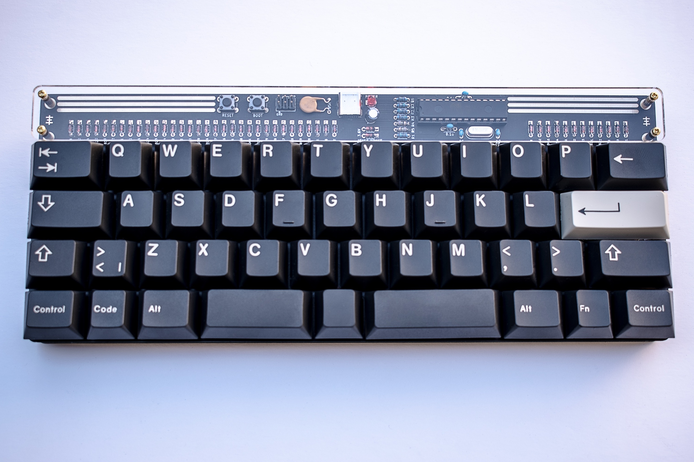

# ROMEO
 Staggered 40% keyboard pcb assembled with only through hole components, including USB Type-C

**[BOM, Build Guide, and Flashing Information](./doc)**

**Kits available at [cftkb.com](https://www.cftkb.com)**

**[Optional High Profile Lasercut Acrylic Case](./case)**

